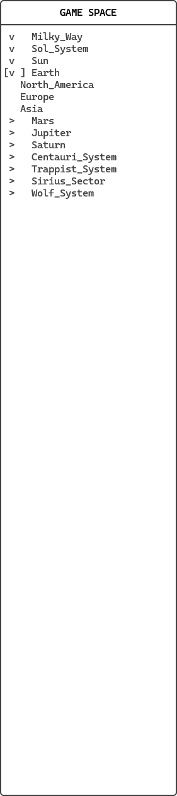

# Gamespace Navigation

Gamespace is the term used to describe the simulations enviroment. For more information about the gamespace, [visit its section in the server chapter](../2_Server/3_gamespace_cmds.md).

In the client, gamespace is represented as an expandable list on the left side panel.

Use the panel to choose which node you want to manage your assets in. Use the arrows to expand the sectors down to the locations level.

Each location has 3 sections: *Market, Industry and Logistics*.

Continue the tutorial to learn how to manage trade in the market section.

