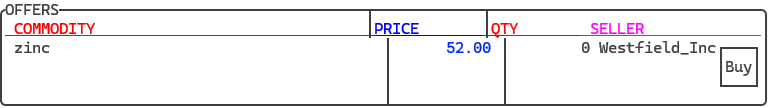
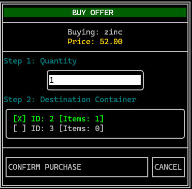
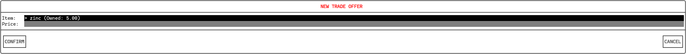

# Market

There are 2 possible operations to do on a market: buy listed trade offers or post your own offer.

Trade offers are created by entities wanting to sell items on the markets. Each trade offer is ties to a commodity and has a price per unit and a total price parameters.

Entities are able to buy either entire trade offers or only partially. If the trade offer is bought whole, it will be deleted and the bought items will be transfered to the buying entity. In case of a partial purchase, the trade offer will remain until it is purchsed whole.

Trade offers can be deleted by the posting entity.

## Buying

If you chose a trade offer and want to buy it, you can click on the *Buy* button.

This will open a form where you can choose the amount you want to buy and the target container to which the bought items will be stored.

Click *Confirm purchase* to finish the transaction. The form will close automatically.

## Selling

To sell a commodity, you have to create a trade offer by clicking on the *Add trade offer* button at the bottom of the market screen.

Once you click the button, you will be presented with a form showing all availible commodities stored in the location. It will list the commodities name and stored amount.

Select the commodity you want to sell and then type the price per unit you want the offer to have. The total price of the offer will then be calculated.

Confirm the process by selecting the *Confirm* button. The form will be closed automatically.

