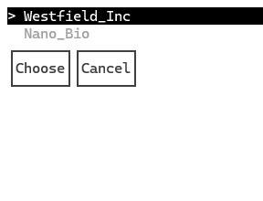

# Choosing Entity To Play

When you sucessfully connect to a server, it will present you with a list of playable entities. You will then have to choose one entity to play.

> **Note:** Once you choose your entity, the server will only send you a copy of the data that is relevant to your entity. This data copy is called a local copy.

Continue the tutorial to [Navigating the game space](2_navigation.md).