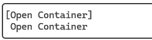
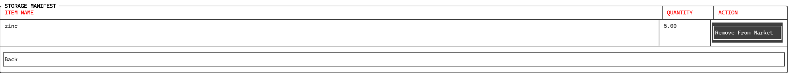

# Logistics

In the logistics section, you can view your local containers and view their contents.

You can see the containers represented in a list, where each container coresponds to a button that opens a screen with its contents.

Once you open a container you will see a list of its stored items. This screen is called a storage manifest. Each item has its stored quantity listed as well as an action button. If the particullar item package is being offered on the local market, the button will read *Remove from market*. With this operation, you will remove this item's particular listing from the local market.

If the item package is not offered, the button will read *Transfer*. With this action, you can move the item into a different container located in the same location. You can split the item's package, transfering only a limited amount, which will result in the creatin of a new package that will get stored in the desired container and both packages will have their sum amount equal to the amount of the original package.

