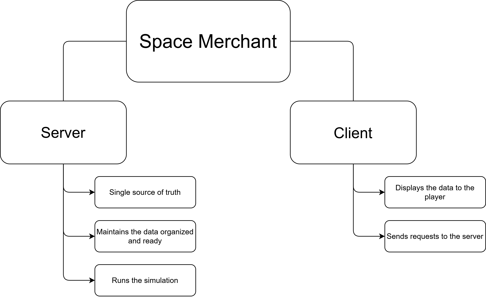

# Space Merchant

## Welcome to the Frontier.
**Space Merchant** is a lightweight, robust trade simulator designed to emulate the complexities of a galactic economy within a virtual environment. Whether you are a developer looking to host a persistent universe or a player seeking to corner the market on Dilithium, this documentation is your flight manual.

---

### 🌌 Core Architecture
The system is built on a high-performance **Client-Server** model to ensure data integrity and real-time synchronization:

* **The Server:** The "Brain" of the operation. It handles the procedural market fluctuations, inventory databases, and trade validations.
* **The Client:** The "Cockpit." It provides the interface for players to interact with the market, manage their fleet, and visualize price trends.
 
### 🚀 What makes Space Merchant unique?
* **Dynamic Economy:** Prices aren't static; they react to supply, demand, and player intervention.
* **Modular Design:** Easily scalable from a local private session to a wide-area network simulation.
* **Low Overhead:** Designed to run efficiently without requiring a supercomputer to calculate a simple trade.

> **Note:** Proper server configuration is vital for a smooth trading experience. Make sure to check the [Server Introduction](./2_Server/1_intro.md) before launching.

---

### Ready to build your empire? 
The stars are waiting. Start the tutorial on the next page to get your first station online!